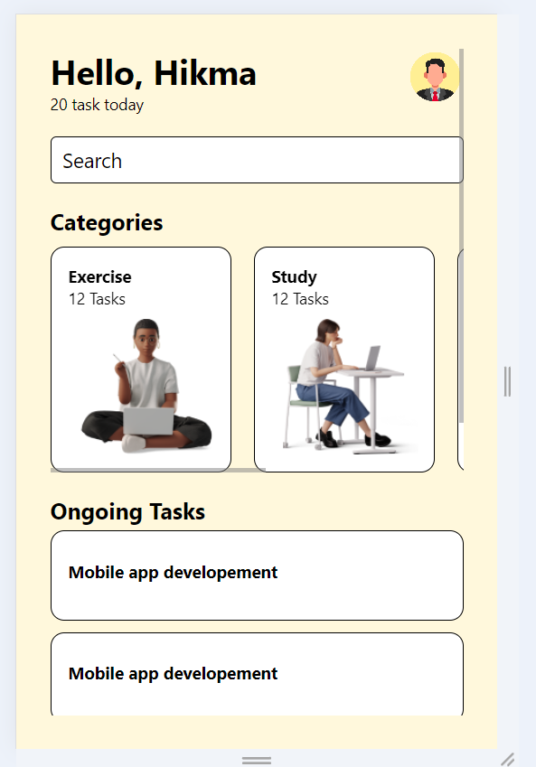

# Mobile Application Assignment 3

This application demonstrates a simple task management UI using React Native.

# DCIT 202 ASSIGNMENT 3

## Components
- **App**: Sets up navigation and main structure.
  **Search tab**: It is used to search for components on the app
- **HomeScreen**: Displays categories and ongoing tasks.
- **Category**: Custom component to render each category.

## Screenshots

